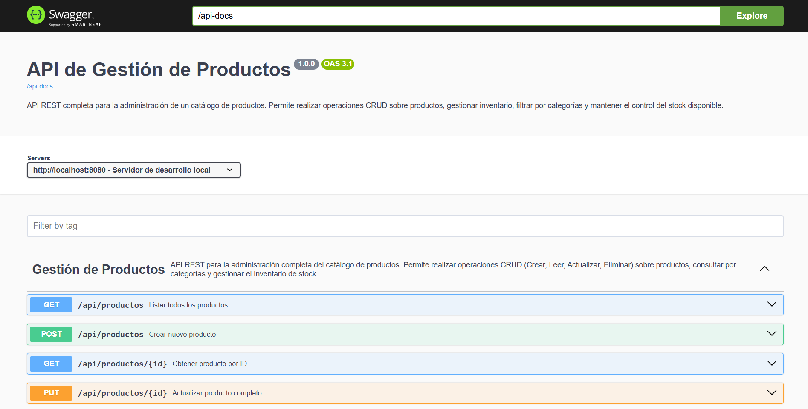
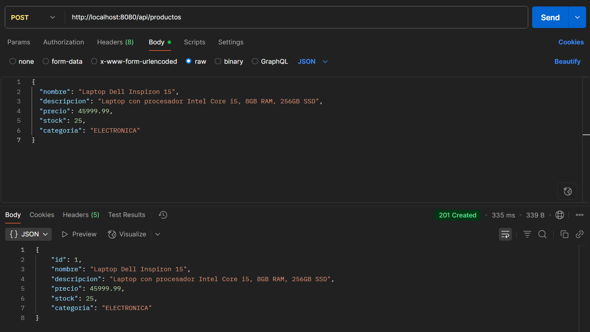
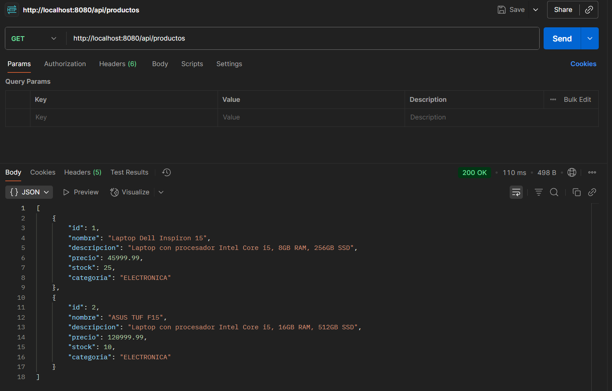
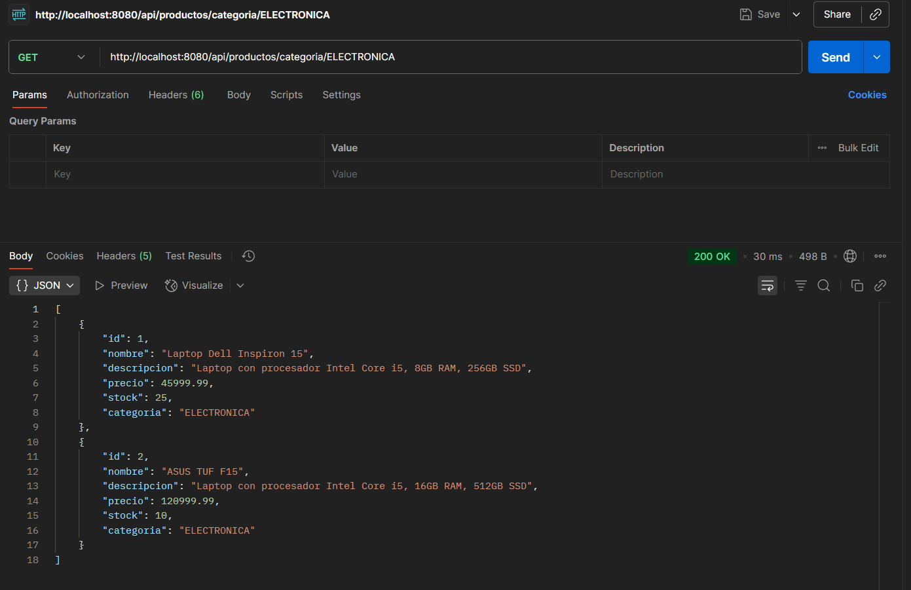
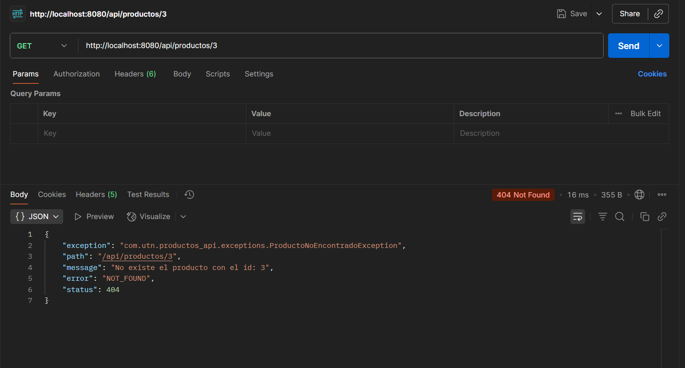
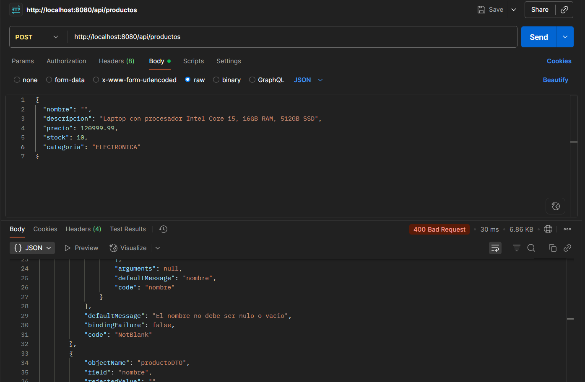
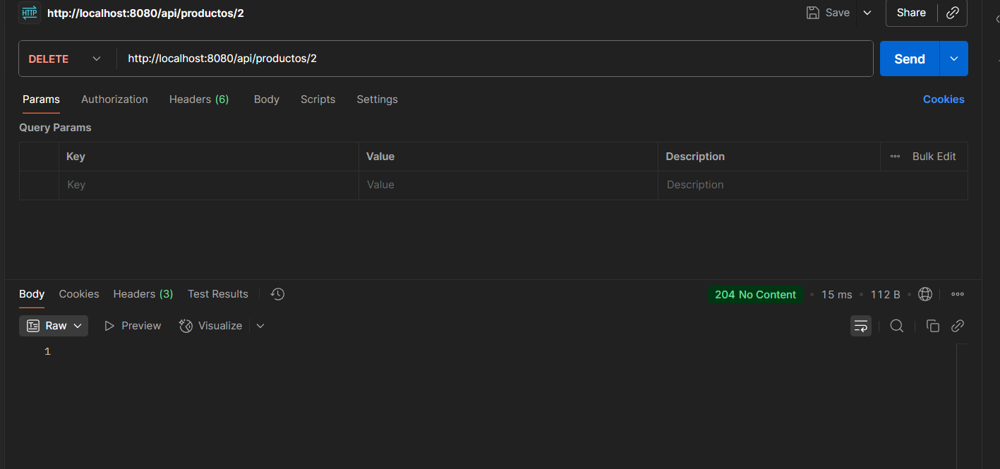
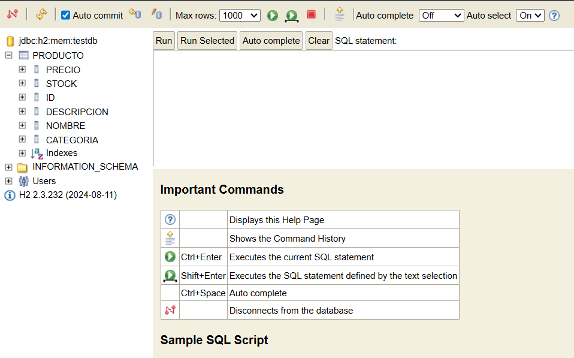

# 🛍️ API REST de Gestión de Productos

## 📝 Descripción del Proyecto

API REST completa y profesional desarrollada con Spring Boot para la gestión de un catálogo de productos de e-commerce. El sistema permite realizar operaciones CRUD (Crear, Leer, Actualizar, Eliminar) sobre productos, gestionar inventario, filtrar por categorías y mantener el control del stock disponible.

Este proyecto implementa las mejores prácticas de desarrollo de APIs REST, incluyendo:
- Arquitectura en capas (Controller, Service, Repository)
- Validación de datos con Bean Validation
- Manejo centralizado de excepciones
- Persistencia de datos con Spring Data JPA
- Documentación interactiva con Swagger/OpenAPI
- DTOs para desacoplar la capa de presentación del modelo de dominio

---

## ⚙️ Tecnologías Utilizadas

| Tecnología | Versión | Descripción |
|-----------|---------|-------------|
| **Java** | 17+ | Lenguaje de programación |
| **Spring Boot** | 3.x | Framework principal |
| **Spring Web** | - | Desarrollo de APIs REST |
| **Spring Data JPA** | - | Persistencia de datos |
| **H2 Database** | - | Base de datos en memoria |
| **Hibernate Validator** | - | Validación de datos |
| **Lombok** | - | Reducción de código boilerplate |
| **SpringDoc OpenAPI** | 2.3.0 | Documentación Swagger |
| **Maven** | - | Gestión de dependencias |

---

## 📁 Estructura del Proyecto

```
src/main/java/com/utn/productos_api/
├── controller/          # Controladores REST (Capa de presentación)
│   └── ProductoController.java
├── service/            # Lógica de negocio
│   └── ProductoService.java
├── repository/         # Acceso a datos (Spring Data JPA)
│   └── ProductoRepository.java
├── model/              # Entidades JPA
│   ├── Producto.java
│   └── Categoria.java
├── dto/                # Data Transfer Objects
│   ├── ProductoDTO.java
│   ├── ProductoResponseDTO.java
│   └── ActualizarStockDTO.java
├── exception/          # Manejo de excepciones
│   ├── ExceptionManager.java
│   ├── ExceptionManagerService.java
│   ├── StockInsuficienteException.java
│   └── ProductoNoEncontradoException.java
└── mapper/             # Mapeo entre entidades y DTOs
    └── ProductoMapper.java
```

---

## 🚀 Instrucciones para Clonar y Ejecutar

### Requisitos Previos
- Java 21
- Maven 3.6+
- IDE IntelliJ IDEA

### Pasos de Instalación

1. **Clonar el repositorio**
```bash
  git clone https://github.com/TomCab98/utn-spring-apirest-products.git
  cd utn-spring-apirest-products
```

2. **Compilar el proyecto**
```bash
  mvn clean install
```

3. **Ejecutar la aplicación**
```bash
  mvn spring-boot:run
```

O desde tu IDE, ejecuta la clase principal `ProductosApiApplication.java`

4. **Verificar que la aplicación esté corriendo**
```
La aplicación estará disponible en: http://localhost:8080
```

---

## 🌐 Endpoints de la API

### Base URL: `http://localhost:8080/api/productos`

| Método | Endpoint | Descripción | Request Body | Response |
|--------|----------|-------------|--------------|----------|
| `GET` | `/api/productos` | Listar todos los productos | - | `200 OK` Lista de productos |
| `GET` | `/api/productos/{id}` | Obtener producto por ID | - | `200 OK` Producto / `404 Not Found` |
| `GET` | `/api/productos/categoria/{categoria}` | Filtrar por categoría | - | `200 OK` Lista de productos |
| `POST` | `/api/productos` | Crear nuevo producto | `ProductoDTO` | `201 Created` Producto creado |
| `PUT` | `/api/productos/{id}` | Actualizar producto completo | `ProductoDTO` | `200 OK` Producto actualizado |
| `PATCH` | `/api/productos/{id}/stock` | Actualizar solo stock | `ActualizarStockDTO` | `200 OK` Producto actualizado |
| `DELETE` | `/api/productos/{id}` | Eliminar producto | - | `204 No Content` / `404 Not Found` |

### Categorías Disponibles
- `ELECTRONICA`
- `ROPA`
- `ALIMENTOS`
- `HOGAR`
- `DEPORTES`

---

## 📋 Ejemplos de Request/Response

### Crear Producto (POST)

**Request: (POST /api/productos - Content-Type: application/json)**
```json
{
  "nombre": "Laptop Dell Inspiron 15",
  "descripcion": "Laptop con procesador Intel Core i5, 8GB RAM, 256GB SSD",
  "precio": 45999.99,
  "stock": 25,
  "categoria": "ELECTRONICA"
}
```

**Response: (201 Created)**
```json
{
  "id": 1,
  "nombre": "Laptop Dell Inspiron 15",
  "descripcion": "Laptop con procesador Intel Core i5, 8GB RAM, 256GB SSD",
  "precio": 45999.99,
  "stock": 25,
  "categoria": "ELECTRONICA"
}
```

### Listar Todos los Productos (GET)

**Request:**
```
GET /api/productos
```

**Response: (200 OK)**
```json
[
  {
    "id": 1,
    "nombre": "Laptop Dell Inspiron 15",
    "descripcion": "Laptop con procesador Intel Core i5",
    "precio": 45999.99,
    "stock": 25,
    "categoria": "ELECTRONICA"
  },
  {
    "id": 2,
    "nombre": "Remera Nike Deportiva",
    "descripcion": "Remera deportiva talle M",
    "precio": 8500.50,
    "stock": 100,
    "categoria": "ROPA"
  }
]
```

### Actualizar Stock (PATCH)

**Request: (PATCH /api/productos/1/stock - Content-Type: application/json)**
```json
{
  "stock": 50
}
```

**Response: (200 OK)**
```json
{
  "id": 1,
  "nombre": "Laptop Dell Inspiron 15",
  "descripcion": "Laptop con procesador Intel Core i5",
  "precio": 45999.99,
  "stock": 50,
  "categoria": "ELECTRONICA"
}
```

### Error 404 - Producto No Encontrado

**Request:**
```
GET /api/productos/999
```

**Response: (404 Not Found)**
```json
{
  "timestamp": "2025-11-13T10:30:00",
  "status": 404,
  "error": "Not Found",
  "message": "Producto no encontrado con ID: 999",
  "path": "/api/productos/999"
}
```

### Error 400 - Validación

**Request: (POST /api/productos - Content-Type: application/json)**
```json
{
  "nombre": "PC",
  "precio": -100,
  "stock": null
}
```

**Response: (400 Bad Request)**
```json
{
  "timestamp": "2025-11-13T10:30:00",
  "status": 400,
  "error": "Bad Request",
  "errors": {
    "nombre": "El nombre debe tener entre 3 y 100 caracteres",
    "precio": "El valor no puede ser inferior a $0,01",
    "stock": "El stock no puede ser nulo",
    "categoria": "La categoria no puede ser nula"
  },
  "path": "/api/productos"
}
```

---

## 🔗 Acceso a Herramientas

### Swagger UI (Documentación Interactiva)
```
http://localhost:8080/swagger-ui.html
```
Interfaz web interactiva para probar todos los endpoints de la API con ejemplos y validaciones.

### OpenAPI Docs (JSON)
```
http://localhost:8080/api-docs
```
Especificación OpenAPI en formato JSON.

### Consola H2 Database
```
http://localhost:8080/h2-console
```

**Credenciales:**
- **JDBC URL:** `jdbc:h2:mem:productosdb`
- **Username:** `sa`
- **Password:** *(dejar vacío)*

---

## 📸 Capturas de Pantalla

### 1. Swagger UI - Documentación Completa

*Vista general de todos los endpoints documentados en Swagger UI*

### 2. Crear Producto (POST) - Éxito

*Creación exitosa de un producto con código 201 Created*

### 3. Listar Productos (GET)

*Listado completo de todos los productos registrados*

### 4. Filtrar por Categoría

*Filtrado de productos por categoría ELECTRONICA*

### 5. Error 404 - Producto No Encontrado

*Respuesta estructurada cuando se busca un producto inexistente*

### 6. Error 400 - Validación Fallida

*Errores de validación detallados al intentar crear un producto con datos inválidos*

### 7. Actualizar Stock (PATCH)

*Actualización parcial del stock de un producto*

### 8. Eliminar Producto (DELETE)

*Eliminación exitosa con código 204 No Content*

### 9. Consola H2 - Datos Persistidos

*Verificación de datos persistidos en la base de datos H2*

---

## ✅ Validaciones Implementadas

### ProductoDTO (Crear/Actualizar)
- **Nombre:** No nulo, no vacío, entre 3 y 100 caracteres
- **Descripción:** Máximo 500 caracteres
- **Precio:** No nulo, mínimo $0.01
- **Stock:** No nulo, mínimo 0
- **Categoría:** No nula, debe ser un valor válido del enum

### ActualizarStockDTO
- **Stock:** No nulo, mínimo 0

---

## 🛡️ Manejo de Excepciones

El sistema implementa un manejo centralizado de excepciones con `@ControllerAdvice`:

| Excepción | Código HTTP | Descripción |
|-----------|-------------|-------------|
| `ProductoNotFoundException` | 404 | Producto no encontrado por ID |
| `MethodArgumentNotValidException` | 400 | Errores de validación de datos |
| `Exception` | 500 | Error interno del servidor |

Todas las respuestas de error siguen una estructura consistente:
```json
{
  "timestamp": "2025-11-13T10:30:00",
  "status": 404,
  "error": "Not Found",
  "message": "Mensaje descriptivo del error",
  "path": "/api/productos/999"
}
```

---

## 🗄️ Base de Datos

### Diagrama de la Entidad Producto

```sql
CREATE TABLE producto (
    id BIGINT AUTO_INCREMENT PRIMARY KEY,
    nombre VARCHAR(100) NOT NULL,
    descripcion VARCHAR(500),
    precio DOUBLE NOT NULL,
    stock INTEGER NOT NULL,
    categoria VARCHAR(20) NOT NULL
);
```

### Configuración H2
- **Modo:** En memoria (los datos se pierden al reiniciar)
- **Dialect:** H2Dialect
- **DDL Auto:** Update (crea/actualiza tablas automáticamente)
- **Show SQL:** Habilitado para debugging

---

## 👤 Autores

**Tomas Cabanillas - 46317**  
**Maria Jose Lucero - 46272**  
**Santiago Wengorra - 50205**  
**Jose Sandoval - 43782**  

**Universidad:** Universidad Tecnológica Nacional (UTN)  
**Materia:** Desarrollo de software  
**Año:** 2025

---